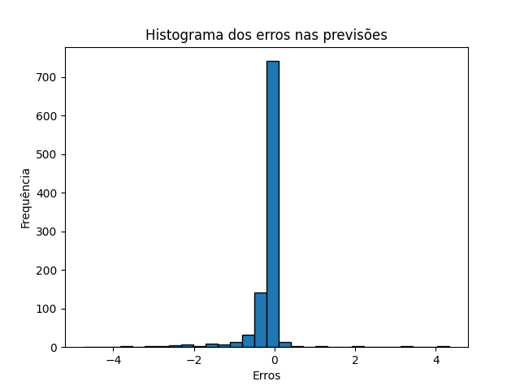

# Preditor de Avaliação de Filmes

Este projeto é um sistema de predição de notas de filmes desenvolvido como parte do desafio "O Desafio Netflix". O objetivo é prever a nota que um usuário daria a um filme que ele ainda não avaliou, utilizando a técnica de Decomposição em Valores Singulares (SVD) e comparar as previsões com as notas reais. A precisão dessas previsões é avaliada através de um histograma dos erros de predição com base em perturbações aleatórias no conjunto de dados.

## Visão Geral do Projeto

Serviços de streaming, como a Netflix, enfrentam o desafio de personalizar recomendações em um vasto catálogo de conteúdo. Normalmente, os usuários consomem uma pequena parte desse catálogo, então é fundamental entender suas preferências para recomendar itens relevantes. Este projeto propõe resolver esse problema ao prever que nota um usuário daria a um filme que ainda não assistiu, com base no comportamento passado.

### Dataset

Utilizamos o [The Movies Dataset](https://www.kaggle.com/datasets/rounakbanik/the-movies-dataset), com foco no arquivo `ratings_small.csv` (a versão menor do `ratings.csv`). Este dataset contém avaliações de usuários sobre diversos filmes.


A matriz $A$ é construída da seguinte forma:
- Linhas representam usuários (`userId`).
- Colunas representam filmes (`movieId`).
- O conteúdo da matriz são as notas que o usuário atribuiu aos filmes.

### Descrição do Problema

O objetivo é prever a nota que um usuário daria a um filme que ele ainda não avaliou. Os passos para isso são os seguintes:
1. Um valor aleatório na matriz $A$ é selecionado e substituído por um valor aleatório, gerando uma nova matriz $B$.
2. O sistema utiliza a matriz $B$ (com o valor aleatório) para prever o valor original da avaliação, sem acesso direto à matriz $A$.
3. Esse processo é repetido diversas vezes para gerar um histograma dos erros entre as previsões e os valores reais.

### Abordagem Matemática

A abordagem utilizada baseia-se na decomposição da matriz $A$ em três componentes por meio da **Decomposição em Valores Singulares (SVD)**:

$$
A = U \Sigma V^T
$$

Onde:
- $U$: representa os fatores dos usuários.
- $\Sigma$: é uma matriz diagonal com os valores singulares.
- $V^T$: representa os fatores dos filmes.

Ao reduzir essas matrizes para um número menor de dimensões, retemos apenas os componentes mais significativos, o que nos permite aproximar a matriz original e prever os valores faltantes.

### Implementação

O arquivo `demo.py` implementa todo o processo, incluindo o carregamento do dataset, a decomposição da matriz e a geração do histograma de erros.

O script segue os seguintes passos principais:
1. **Carregamento do Dataset**: O usuário carrega `ratings_small.csv`.
2. **Construção da Matriz**: O dataset é transformado em uma matriz onde as linhas representam usuários e as colunas representam filmes, com os valores correspondendo às notas.
3. **Perturbação Aleatória**: Um valor aleatório na matriz é substituído por um valor randômico, criando a matriz $B$.
4. **Decomposição SVD**: A matriz $B$ é decomposta usando SVD, e apenas os 50 principais componentes são mantidos.
5. **Predição da Nota**: O valor original é previsto com base nos componentes reduzidos.
6. **Cálculo do Erro**: O erro entre o valor previsto e o valor real é calculado e armazenado.
7. **Histograma de Erros**: Após 1000 iterações, um histograma dos erros de predição é exibido.

### Como Executar o Código

Para executar o projeto, siga os passos abaixo:

1. Clone o repositório.
2. Instale as bibliotecas necessárias executando:

    ```bash
    pip install -r requirements.txt
    ```

3. Execute o arquivo `demo.py`:

    ```bash
    python demo.py
    ```


5. Após a conclusão do script, será exibido um histograma dos erros de predição, mostrando a distribuição dos erros ao longo de 1000 predições.

### Resultados

O sistema avalia suas predições comparando o valor previsto com o valor real de uma avaliação perturbada aleatoriamente. O histograma gerado mostra a distribuição dos erros, o que ajuda a avaliar a precisão do modelo. Idealmente, os erros devem ser pequenos, indicando previsões precisas.

O histograma fornece insights sobre como o sistema generaliza suas predições e se ele poderia ser utilizado em produção. Se as taxas de erro forem consistentemente baixas, o sistema pode ser adequado para aplicações reais.

### Conclusão



Com base nos resultados obtidos, o sistema demonstra um bom desempenho na predição de notas de filmes utilizando técnicas de fatoração de matriz de forma razoável como é mostrado abaixo, se mostrando eficiente pois a maioria dos erros se encontra no 0. 


### Conclusão Sobre a Utilização em Produção

Dado que os erros observados no histograma são relativamente pequenos, esta abordagem tem potencial para ser utilizada em sistemas de recomendação. Entretanto, testes extensivos em datasets maiores e em diversas condições são necessários para confirmar se o modelo pode ser implantado em um ambiente de produção.
